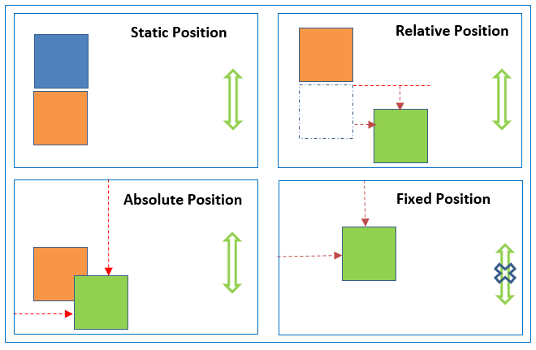

# CSS

---

<details>
<summary>Index</summary>

## Index

- Introduction
- Selectors
- CSS Units
- CSS Learning Strategy
- Makeup
- Box Model
- Layout
- Handling Overflow
- Responsiveness
- Positions
- CSS Custom Property
- CSS Animation
- Documentation
- Rough

</details>

---

<details>
<summary>Introduction</summary>

## Introduction

**CSS** stands for **Cascading Style Sheets**

- CSS is used in web development to apply styling and layout to HTML documents (web pages).
- By combining HTML and CSS, we can create responsive web pages that work well across different screen sizes.
- We can use single `.css` file for multiple `.html` files.


### Syntax

```css
selector {
	property1: value1;
	property2: value2;
}
```

```css
.heading {
	color: green;
	background-color: orange;
}
```

### apply CSS

We can apply **CSS** in 3 ways,

1. Inline
2. Internal
3. External

### 1. Inline

- we can use `style` attribute to apply css styles to a particular element.

```html
<tag style="property1: value1; property2: value2;">Content</tag>
```

```html
<h1 style="color: green; background-color: orange;">content</h1>
```

### 2. Internal

- we can use `style` element to write `css code` for a particular HTML document.
- Generally, we use `<style>` element in head part.

```html index.html
<!DOCTYPE html>
<html>
	<head>
		<style>
			.heading {
				color: green;
				background-color: orange;
			}
		</style>
	</head>
	<body>
		<h1 class="heading">content</h1>
	</body>
</html>
```

### 3. External

- we can create External CSS Style Sheet with `.css` file extension.
- By using the HTML `<link>` element to link the external CSS file to the HTML document in the `<head>` section.

```html index.html
<!DOCTYPE html>
<html>
	<head>
		<link rel="stylesheet" href="./index.css" />
	</head>
	<body>
		<h1 class="heading">content</h1>
	</body>
</html>
```

```css index.css
.heading {
	color: green;
	background-color: orange;
}
```

- The HTML **rel** attribute stands for a relationship of the linked document to the current document. In this case, it is a stylesheet.
- The HTML **href** attribute stands for **Hyper Reference** to the URL/path of the CSS file.

### Fundamental Concepts

- Inheritance
- Specificity
- Cascade

#### Inheritance

- Children Inherits the Parent Property is called Inheritance.

```css
.parent {
	color: blue; /*  Inherited Property */
	border: 2px black solid; /*  Non-Inherited Property */
}
```

#### Specificity

- CSS **Specificity** is how the browser decides which CSS property values are the most relevant to an HTML element and apply those CSS property values to the HTML element.

Browser gives priority to select the CSS property.

1. !important
2. Inline
3. Id
4. Class
5. Tag
6. Universal

#### Cascade

- The source order of CSS Ruleset matters.
- when two CSS Ruleset have equal specificity, the one that comes last in the CSS is applied.

```css
    .container {
    background-color: green;
    box-shadow: 0 0 10px black;
 }

  .container {
      / *These are applicable */
      background-color: red;
      box-shadow: 0 0 10px black;
  }
```

</details>

---

<details>
<summary>Selectors</summary>

## Selectors

- The CSS Selectors are used to select the HTML elements that we want to apply style.

1. Tag selector -> same kind of tags selection
2. Class selector -> group of elements selection
3. Id selector -> only one particular element selection
4. Attribute selector
5. Pseudo selector -> user interactions
6. Mixed / Child selector
7. Group selection
8. Universal Selector

### Specificity

- CSS Specificity is how browsers decide which CSS property values are the most relevant to an HTML element and apply those CSS property values to the HTML element.

selector priority from High to Low :

1. !important
2. inline styles
3. id selector
4. class selector
5. tag selector
6. Universal selector

### Tag Selector

```html
<p>I am Tag Selector</p>
<p>I am Tag Selector</p>
<p>I am Tag Selector</p>
```

```css
p {
	color: red;
	background-color: green;
}
```

### Id Selector

```html
<p id="myParagraph">I am ID Selector</p>
<p>I am Tag Selector</p>
<p>I am Tag Selector</p>
```

```css
#myParagraph {
	color: red;
	background-color: green;
}
```

### class Selector

- We can provide multiple class names separated by space as a value to the HTML class attribute.
- `<tag class="name1 name2 name3 name4 ...">Content</tag>`

```html
<p id="myParagraph">I am ID Selector</p>
<p class="my-paragraph">I am Class Selector</p>
<p class="my-paragraph">I am Class Selector</p>
```

```css
.my-paragraph {
	color: red;
	background-color: green;
}
```

### Attribute Selector

```html
<input type="text" placeholder="textbox" />
<input type="password" placeholder="password" />
```

```css
input[type] {
	padding: 10px;
	border-radius: 10px;
}

input[type="password"] {
	background-color: orange;
}
```

### Pseudo selector

- styles applied when user interact with html element.
- Pseudo selector is a dynamic selector.
- Apply css dynamically.

`selector:event`

```html
<h1 class="heading-element">Please put cursor on me</h1>
<input class="textbox" type="text" placeholder="please focus on me" />
```

```css
.heading-element:hover {
	box-shadow: 0 0 10px black;
}

.textbox:focus {
	box-shadow: 0 0 10px black;
}
```

### Mixed Selector / Child Selector

```html
<div class="parent">
	<h1 id="#child">I am First Child</h1>
	<h1>I am Second Child</h1>
</div>
```

```css
.parent > #child {
	padding: 10px;
	color: orange;
	background-color: green;
	border-radius: 10px;
}
```

### Group Selection

```html
<h1 class="my-heading">Class Selection</h1>
<h1 id="myHeading">Id Selection</h1>
```

```css
.my-heading,
#myHeading {
	padding: 10px;
	background-color: green;
	border-radius: 10px;
	box-shadow: 0 0 10px black;
}
```

### Universal Selector

- The universal selector selects all the HTML elements in an HTML document.

```html
<div>1</div>
<div id="myBox">2</div>
<div class="my-box">3</div>
```

```css
* {
	margin: 20px;
}
```


</details>

---

<details>
<summary>CSS Units</summary>

## CSS Units

1. pixel
2. viewport
3. percentage

### 1 pixel

- pixels are fixed size

```css
.heading {
	width: 200px;
	height: 100px;
}
```

### 2 viewport

- viewport : view port is depended on device screen size
- **viewport** is the visible area of a web page that a user can see within their web browser window without scrolling.

```css
.heading {
	width: 100vw;
	height: 50vh;
}
```

### 3 percentage

- percentage : percentage is depended on parent container

```css
.heading {
	width: 100%;
}
```

</details>

---

<details>
<summary>CSS Learning Strategy</summary>

## CSS Learning Strategy

1. Makeup
2. Box Model
3. Layout

</details>

---

<details>
<summary>Makeup</summary>

## Makeup

- we are adding some css properties to particular element.

1. Text Properties

### 1. Text Properties

1. color
2. font styles
3. text alignment

#### color

```css
.heading {
	color: green;
}

.paragraph {
	color: #000000;
}
```

#### font styles

1. `font-size: 28px;`
2. `font-weight:bold;`
3. `font-style:italic;`
4. `font-family: Arial, sans-serif;`
5. `text-decoration: underline;`
6. `text-transform: uppercase;`

```css
.heading {
	font-size: 28px;
	font-weight: bold;
	font-style: italic;
	font-family: Arial, sans-serif;
	text-decoration: underline;
	text-transform: uppercase;
}
```

#### text alignment

`text-align` property specifies the horizontal alignment of the text in an HTML element.

- `text-align:left;`
- `text-align:center;`
- `text-align:right;`

```css
.heading {
	text-align: right;
}
```

</details>

---

<details>
<summary>Box Model</summary>

### Box Model

- **Content** -> The content of the box, where text or image appear.

1. **Width & Height** -> The content width and height.
2. **Padding** -> The space between the content and the border.
3. **Border** -> A borderline that goes around the padding.
4. **Outline** -> An outline that goes around the border.
5. **Margin** -> The space outside the border.

```css
.heading {
	width: 200px;
	height: 100px;
	padding: 20px;
	border: solid black 40px;
	outline: solid green 10px;
	margin: 60px;
}
```


### Intrinsic vs Extrinsic

- Some elements have a natural size based on their content. This is called intrinsic size.
- If we set a size using CSS, like width or height, it’s called extrinsic size.

### 1. width & height

It gives HTML element width & height

- `width:100px;`
- `height:100px;`
- `min-width:50px;`
- `max-width:400px;`
- `min-height:80px;`
- `max-height:200px;`

### 2. padding

The space between border and content.

- `padding:10px;` => TRBL
- `padding-top:10px;`
- `padding-right:10px;`
- `padding-bottom:10px;`
- `padding-left:10px;`
-

### 3. border
A borderline that goes around the padding.
- `border-style: dashed;`
- `border-width: 5px;`
- `border-color: orange;`
- border shortcut
  - `border:styleName width color;`
  - `border: 5px dashed orange;`
  - `border-left:5px solid greenyellow;`
- `border-radius:10px;`
  - `border-top-right-radius:10px;`
- supporting properties
  - top
  - right
  - bottom
  - left

### 4. outline

An outline that goes around the border.

- `outline-style: dashed;`
- `outline-width: 5px;`
- `outline-color: orange;`
- border shortcut
  - `outline:styleName width color;`
  - `outline: 5px dashed orange;`
    - `outline-left:5px solid greenyellow;`
- supporting properties
  - top
  - right
  - bottom
  - left

### 5. margin
The space outside the border.

- `margin:auto;` It adjust automatically center of horizontal.
- `margin:50px;`(TRBL)
- `margin-top: 50px;`
- `margin-right:50px;`
- `margin-bottom: 50px;`
- `margin-left: 50px;`

### Box-sizing property

- The box-sizing CSS property sets how the total width and height of an element are calculated.
- Box-Sizing property has the following values:

1. content-box (default)
2. border-box

#### 1. **content-box**(Default) :

```css
.container {
	width: 160px;
	height: 80px;
	padding: 20px;
	margin: 10px;
	border: 8px solid red;
	box-sizing: content-box;

	/* Total width: 160px + (2 * 20px) + (2 * 8px) = 216px
     Total height: 80px + (2 * 20px) + (2 * 8px) = 136px
     Content box width: 160px
     Content box height: 80px 
  */
}
```

#### 2. **border-box**:

Fixed width and height. It is adjustment to given width and height.

```css
.container {
	width: 160px;
	height: 80px;
	padding: 20px;
	margin: 10px;
	border: 8px solid red;
	box-sizing: border-box;

	/* Total width: 160px
     Total height: 80px
     Content box width: 160px - (2 * 20px) - (2 * 8px) = 104px
     Content box height: 80px - (2 * 20px) - (2 * 8px) = 24px 
  */
}
```

### Box Shadow

- `box-shadow:x y blur color;`
- `box-shadow:0 0 10px black;`


## Background Properties

1. background-color
2. background-image
3. background-repeat
4. background-position
5. background-attachment
6. background-size

### background-color

- `background-color: "orange";`
- `background-color: transparent;`

### background-image

- `background-image: url("source/bg-image.jpg");`
- `background-image:linear-gradient(45deg,black,red,green);`
- `background-image:linear-gradient(to left,black,red,green);`
- `background-image:radial-gradient(black,red,green);`

### background-repeat

- `background-repeat:repeat;`
- `background-repeat:no-repeat;`
- `background-repeat:repeat-x;`
- `background-repeat:repeat-y;`

### background-position

`background-position: top left;`


### background-attachment

- `background-attachment: scroll;`
- `background-attachment: fixed;`

### All Backgrounds Shortcut

```css
shortcut {
	background: color image repeat attachment position;
}
```

- `background:red url("./source/lion.jpg") no-repeat scroll center center;`

### background-size

`background-size:cover;`


</details>

---

<details>
<summary>Layout</summary>

## Layout

- A Layout is used to arrange the elements on the website.

### Methods to Design a Layout 
 
- Mainly, there are two methods that help design the webpage layout.

1. Flexbox
2. CSS Grid

### Flexbox

- Flexbox is a layout method that helps to arrange the HTML elements in rows(horizontally) or columns(vertically).

Flexbox Layout CSS Properties:

1. `display` -> define the flexbox (layout method)
    - flex
    - inline-flex
    - grid
    - none
2 `flex-direction` -> The Flex Direction specifies the direction of the flex items in the Flexbox Container.
    - row
    - column
- `justify-content`
  - The justify-content property specifies the alignment of flex items along the main axis.
  - justify content property can have the following values:
    - `flex-start` (default)=> All the elements will arrange to the start of the container.
    - `center` => All the elements will arrange to the center of the container.
    - `flex-end` => All the elements will arrange to the end of the container.
    - `space-between` => The extra space is added only between the items. The first item stays at the start, and the last item stays at the end. The space is shared between the middle items.
    - `space-around` => Every flex item will get equal space around them.
- `align-items`
  - The align-items property specifies the alignment of flex items along the cross-axis.
  - Align items property can have the following values:
    - `stretch` (default)=> will stretch its available height.
    - `flex-start` => will be at the starting of the flex container.
    - `center` => will be at the center of the available height.
    - `flex-end` => will be at the ending point of the available height.
- `flex-wrap`
  - The flex-wrap property arranges the flex items in multiple lines.
  - Flex wrap property can have the following values:
    - nowrap(default)
    - wrap
    - wrap-reverse

- `align-self`
  - The align-self property specifies the alignment of individual flex items along the cross axis.
  - Align self property can have followed values:
    - `flex-start`
    - `center`
    - `flex-end`
    - `stretch`
    - `auto`(default)

If the value of align-self is auto, then the align-items value of its Flex container gets inherited.

- `order`
  - The order property specifies the order of flex items in the Flex container.
  - order property has the following values:
    - 0 (default)
    - +ve values
    - -ve values

```html index.html
<!DOCTYPE html>
<html>
	<head>
		<style>
			.flex-container {
				display: flex;
				flex-direction: row;
				justify-content: space-between;
				align-items: center;
				flex-wrap: wrap;
			}

			.item1 {
				order: 3;
				align-self: flex-start;
			}

			.item2 {
				order: 1;
				align-self: center;
			}

			.item3 {
				order: 2;
				align-self: flex-end;
			}
		</style>
	</head>
	<body>
		<div class="flex-container">
			<div class="item1">1</div>
			<div class="item2">2</div>
			<div class="item3">3</div>
		</div>
	</body>
</html>
```

### Block vs Inline

- The block-level element always starts on a new line. It occupies entire horizontal space of its Parent.

- The inline element does not start on a new line. It occupies only its content width.

```css
.selector1 { display:block; } .selector2 { display:inline; }
```

</details>

---

<details>
<summary>Handling Overflow</summary>

## Handling Overflow

- content overflow can be handled using the CSS overflow property.  
- **overflow** : child element data overflowed on parent element.

1. visible (default)=> CSS tries to avoid data loss. Hence, the `overflow:visible;` is the default value for it.
   - `overflow:visible;`
2. hidden => The overflow is clipped, and the rest of the content will be invisible.
   - `overflow: hidden;`
3. scroll => The overflow is clipped, and a scrollbar is added to see the rest of the content.
   - `overflow: scroll;`
   - `overflow-x: scroll;`
   - `overflow-y: scroll;`
4. auto => It is similar to scroll, but it adds scrollbars only when necessary.

- `overflow: auto;`

```css parent.css
.parent {
	height: 100px;
	width: 200px;
	border: 10px solid green;
	overflow: scroll;
}
```

</details>

---

<details>
<summary>Responsiveness</summary>

## Responsiveness
- A responsive website will automatically adjust for different screen sizes and viewports.

## Media Query

- Media queries play a crucial part while developing Responsive Layouts.
- Responsiveness is a perfectly fit for all the different screen sizes.
- We can create a responsive website using media queries or flexbox.  
- Using Media queries, we can conditionally apply styles based on the device type (e.g. printers, TVs, etc.) and media features (e.g. viewport width, etc.).

### syntax:

```css
@media media-type and (media-feature-expression) {
	/* CSS rules go here */
}
```

- **Media Type**: Media type describes the general category of devices. Possible types of media are screen, print, tv, all, ...etc.
- **Media Feature**: Using Media Features, we can write Media Query for a specific feature. Examples: width, height, orientation, etc.

### Media Types

possible types of media are:

- screen => For all screened devices (mobile, laptops, tablets, ...etc)
- print = For printers
- tv => For Televisions
- all => Matches all types of devices and more...

### screen

```css
@media screen and (max-width: 800px) {
	.bg-container {
		background-color: deepskyblue;
	}
}

@media screen and (min-width: 801px) {
	.bg-container {
		background-color: yellowgreen;
	}
}
```

### Logical Operators

- and
- not
- comma

#### and

- using `and` operator can combine multiple Media Features.
- syntax:

```css
@media (media-feature-expression) and (media-feature-expression) {
	/* CSS rules go here */
}
```

- we can also join media feature with a media type.
syntax:

```css
@media media-type and (media-feature-expression) {
	/* CSS rules go here */
}
```

#### not

- The `not` operator is a Media Query Modifier. It negates the entire Media Query result.
- If you use the `not` operator, you must also specify a media type.

syntax:

```css
@media not screen and (min-width: 600px) {
	/* CSS rules go here */
}
```

#### comma

Using ,(comma) operator we can combine multiple Media Queries.

```css
@media (orientation: landscape), (min-width: 600px) {
	.bg-container {
		background: yellowgreen;
	}
}
```

#### Orientation

- The two most common types of orientation are:

1. landscape => The width of the device is greater than the height.
2. portrait => The width of the device is smaller than the height..

```css
@media (orientation: landscape) {
	.bg-container {
		background-color: orange;
	}
}

@media (orientation: portrait) {
	.bg-container {
		background-color: yellowgreen;
	}
}
```

#### print

```css
@media print {
	.heading {
		color: green;
	}
}
```

</details>

---

<details>
<summary>Positions</summary>

## Positions

- The position property in CSS is used to control the positioning of an element within its containing element.

### position properties

1. `position:static;`
2. `position:relative;`
3. `position:absolute;`
4. `position:fixed;`
5. `position:sticky;`



- **static** => default position of any html element.
- **relative** => It is used to set the element position relative to its normal position.
- **absolute** => this is positioned relative to its parent.
- **fixed** => this is to fix an element in the given position (calculated from view port).
- **sticky** => this is to stick an element in the given position.

### supporting properties:

`top,right,bottom,left`

### z-index

z-index => layers position  
`z-index:1;`

```css
.selector {
	background-color: yellow;
	position: absolute;
	left: 20px;
	top: 20px;
	z-index: 4;
}
```

</details>

---

<details>
<summary>CSS Custom Property</summary>

## CSS Custom Property

A CSS custom property is a variable in CSS.

- variable creation : --variable
- use variable : var(--variable)

```css
.card {
	--spacing: 2px;
	padding: var(--spacing);
	margin-bottom: var(--spacing);
}
```

- If the custom property has to be accessed through the entire HTML document, declare it inside the **:root** pseudo-class.

```css
:root {
	--main-bg-color: brown;
}

.card-1 {
	color: white;
	background-color: var(--main-bg-color);
}
```

</details>

---

<details>
<summary>CSS Animation</summary>

## CSS Animation

To create animations using CSS, you can use the **@keyframes** rule along with CSS properties like

1. `animation-name:anyName;`
2. `animation-duration:3s;`
3. `animation-iteration-count:1 / infinite;` => reputation
4. `animation-timing-function:linear / ease-in / ease-out;`
5. `animation-delay:3s;`

```css
shortcut {
	animation: name duration iteration-count timing-function delay;
}
```

### procedure

step1 => define your element
step2 => apply animation rules

```css
.myAnimation:hover {
	animation: animationEffects 2s infinite linear 1s;
}
```

```css
@keyframes animationEffects {
	0% {
		background-color: green;
	}

	50% {
		background-color: red;
	}

	100% {
		background-color: blue;
	}
}
```

</details>

---

<details>
<summary>Documentation</summary>

## Documentation

- webdev : `https://web.dev/learn/css`
</details>

---
